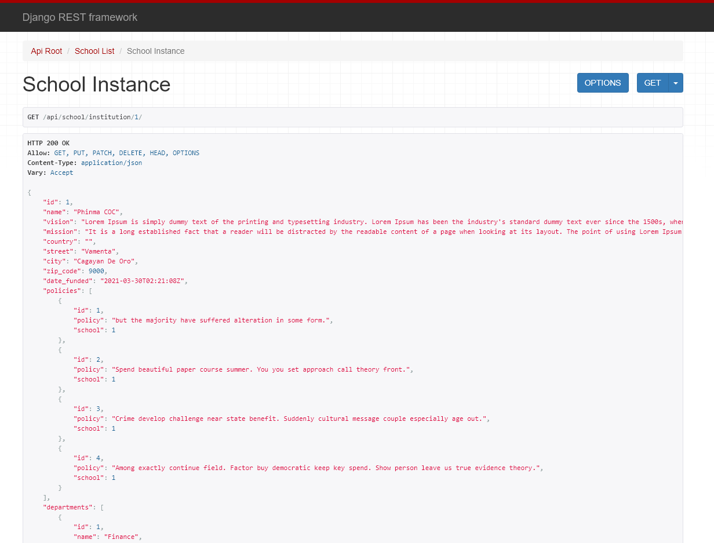

# School-Management-API

This project is open source - the sole purpose of this project is to showcase my skills on REST API for future clients. Also, the project is front end ready. Accessing the project is simple, just follow the instructions below:

1. Clone the project, please refer to this link for instructions https://git-scm.com/book/en/v2/Git-Basics-Getting-a-Git-Repository               
   Clone url: https://github.com/joshuaochia/School-Management-API.git
   
2. After cloning the project, go the directory of School-Management-API/SchoolManagement_API using terminal - After that, run the project by typing "python manage.py runserver" 

## School-Management-API Apps

### School 
POST, PUT, PATCH:
- Edit or add a new employee for the school (Admin Access only)
- Edit or add policies for the school (Admin Access only)
- Add new or edit existing departments of the school (Admin Access only)
-  Add new or edit existing departments of the school (Admin Access only)

GET:
- School Detail, policies, departments, courses, and employees

### Populate the DB first with fake data

Command:
   - python manage.py [avail custom command] [int(argument)] 

E.G. python manage.py policies 5

Avail custom command:
   1. policies 
   2. courses
   3. departments
   4. employees
   5. schedule
   6. section
   7. student
   8. subject

Int Argument: How many fake data you want to create

